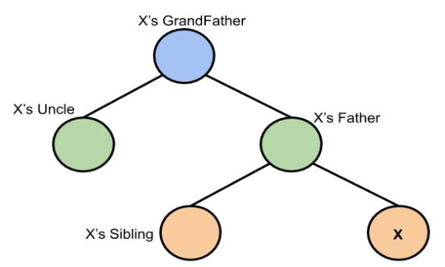

# Red-Black Trees

A red-black tree is a kind of self-balancing binary search tree where each node has an extra bit, and that bit is often interpreted as the colour (red or black). These colours are used to ensure that the tree remains balanced during insertions and deletions. Although the balance of the tree is not perfect, it is good enough to reduce the searching time and maintain it around O(log n) time, where n is the total number of elements in the tree.

>>Rules That Every Red-Black Tree Follows: 
- Every node has a colour either red or black.
- The root of the tree is always black.
- There are no two adjacent red nodes (A red node cannot have a red parent or red child).
- Every path from a node (including root) to any of its descendants NULL nodes has the same number of black nodes.

>>Genaral node
</img>

>In the Red-Black tree, we use two tools to do the balancing. 

- Recoloring
- Rotation

Recolouring is the change in colour of the node i.e. if it is red then change it to black and vice versa. It must be noted that the colour of the NULL node is always black. Moreover, we always try recolouring first, if recolouring doesn’t work, then we go for rotation.

>*Note:*
>The AVL trees are more balanced compared to Red-Black Trees, but they may cause more rotations during insertion and deletion. So if your application involves frequent insertions and deletions, then Red-Black trees should be preferred.

>>Important points:
>>- Black height of the red-black tree is the number of black nodes on a path from the root node to a leaf node.
>>-  Leaf nodes are also counted as black nodes. So, a red-black tree of height h has black height >= h/2.
>>- Height of a red-black tree with n nodes is h<= 2 log2(n + 1).
>>- All leaves (NIL) are black.
>>- The black depth of a node is defined as the number of black nodes from the root to that node i.e the number of black ancestors.
>>- Every red-black tree is a special case of a binary tree.

*Search Algo*
<pre>
searchElement (tree, val)
Step 1:
If tree -> data = val OR tree = NULL
    Return tree
Else
If val < data
        Return searchElement (tree -> left, val)
    Else
        Return searchElement (tree -> right, val)
    [ End of if ]
[ End of if ]

Step 2: END
</pre>

>>*Insertion*  
First, you have to insert the node similarly to that in a binary tree and assign a red colour to it. Now, if the node is a root node then change its colour to black, but if it does not then check the colour of the parent node. If its colour is black then don’t change the colour but if it is not i.e. it is red then check the colour of the node’s uncle. If the node’s uncle has a red colour then change the colour of the node’s parent and uncle to black and that of grandfather to red colour and repeat the same process for him (i.e. grandfather).

>Click <a href="code.c">here</a> to view the code. 

