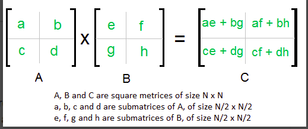
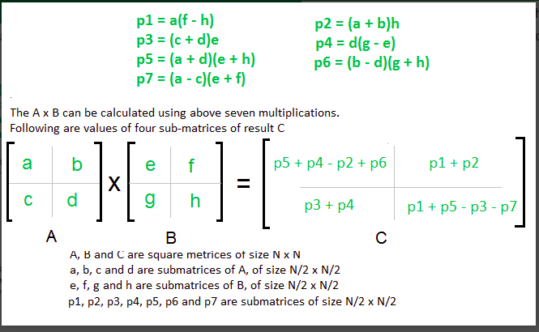

# Strassens Algorithm

Strassen's Algorithm tells us to multiply two matrices using divide and conquer.  
>Using Naive multiplication we get the required result in O(n^3).

>>Using Simple divide and conquer,   
>1) Divide matrices A and B in 4 sub-matrices of size N/2 x N/2 as shown in the below diagram. 
>2) Calculate following values recursively. ae + bg, af + bh, ce + dg and cf + dh.  
>>we still get O(n^3) complexity as T(N) = 8T(N/2) + O(N^2).        
></img>

>>In the above divide and conquer method, the main component for high time complexity is 8 recursive calls.   
The idea of Strassen’s method is to reduce the number of recursive calls to 7.   
Strassen’s method is similar to above simple divide and conquer method in the sense that this method also divide matrices to sub-matrices of size N/2 x N/2 as shown in the above diagram, but in Strassen’s method, the four sub-matrices of result are calculated using following formulae.
</img>

>> Time complexity:  
T(N) = 7T(N/2) +  O(N2)

From Master's Theorem, time complexity of above method is 
O(N^Log7) which is approximately O(N^2.8074)

Click <a href="code.c">here</a> to access the code.
