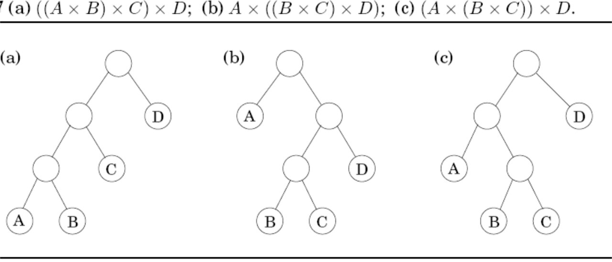
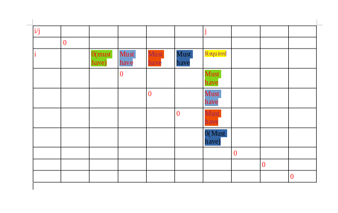

# Key Points 

### ***Chain Matrix Multiplication***

*Problem*

> Given n number of the matrix we are required to find the correct order to multiply the matrices, so that  total number of  multiplication are minimised.    

*Note:-* 
> - Multiplication of (m*n) and (n*p) is O(mnp).  
> - The above problem can be rephrased as optimal way of paranthesizing A1* A2 * A3 * ...An with n-1 paranthesis.    
> - We already know that paranthesising n object with n-1 paranthesis can be represented as binary trees.  
eg. Example</img>

**Algo by Dynamic Programming**

> - *Subproblem* - "For a tree to be optimal it's subtree must be optimal", i.e. for A1,A2...An to be optimal 
Ai,Ai+1,Ai+3,...Ak and Ak+1,Ak+2,...Aj must be optimal.  
>
> - *Relation or Topological order-*  Let C(i,j)=cost of multiplication of Ai,Ai+1,Ai+2,...Aj. So the relation will be
    C(i,j)=min(C(i,k)+C(k+1,j)+(rows of Ai)*(column of Ak)*(rows of Aj)) for all i <= k <j.  
>   Since we need C(1,n) filling the top part of row is sufficient, so fill one diagonal and then fill the next shorter one.   
> 
> - Book-keep the cost of the subtree for recursion. Book-keep the values all the left side till (i,i) and down values till (j,j). (as shown in Method</img>).

<pre>
// Simple Recursion is far more simple.
for( s=1 ; s< n ; s++)
{
    for(i=1;i < n;i++)
    {
        j=i+s;//fill (i,i+1) then next shorter diagonal (i,i+2) and so on
        C(i,j)=min(C(i,k)+C(k+1,j)+(rows of Ai)*(column of Ak)*(rows of Aj)) for all i <= k < j;
    }
}
</pre>

>> Time Complexity =O(n^3).