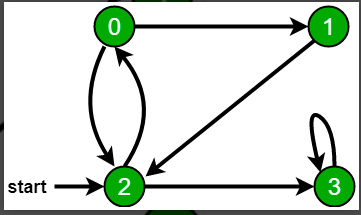
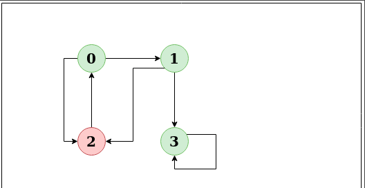

# BFS
Breadth-First Traversal (or Search) for a graph is similar to Breadth-First Traversal of a tree . The only catch here is, unlike trees, graphs may contain cycles, so we may come to the same node again. To avoid processing a node more than once, we use a boolean visited array. For simplicity, it is assumed that all vertices are reachable from the starting vertex. 

Example:  
</img>  
Following is Breadth First Traversal (starting from vertex 2)
2->0->3->1  
Time Complexity: O(V+E)

# DFS
> Depth First Traversal (or Search) for a graph is similar to Depth First Traversal of a tree. The only catch here is, unlike trees, graphs may contain cycles (a node may be visited twice). To avoid processing a node more than once, use a boolean visited array. 

*Basic Algo*
<pre>
Create a recursive function that takes the index of the node and a visited array.

-> Mark the current node as visited and print the node.
-> Traverse all the adjacent and unmarked nodes and call the recursive function with the index of the adjacent node.

</pre>
For disconnected graph
<pre>
-> Create a recursive function that takes the index of the node and a visited array.
-> Mark the current node as visited and print the node.
-> Traverse all the adjacent and unmarked nodes and call the recursive function with the index of the adjacent node.
-> Run a loop from 0 to the number of vertices and check if the node is unvisited in the previous DFS, call the recursive function with the current node.
</pre> 
 
>>- Time complexity: O(V + E), where V is the number of vertices and E is the number of edges in the graph.
>>- Space Complexity: O(V), since an extra visited array of size V is required.  

*Example:*
</img>  
The DFS of above graph starting from 2 is 2->0->1->3

>>Click <a href="code.c">here</a> to access the code