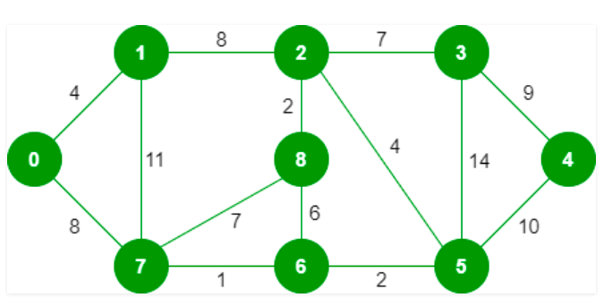

# Kruskal Algorithm
Kruskal Algorithm is a greedy algorithm of obtaining MST of a graph

*Problem*
Given a graph find a corressponding minimum spanning tree.

*Key Point* 
A minimum spanning tree has (V – 1) edges where V is the number of vertices in the given graph. 

**Basic Algo**
<pre>
1. Sort all the edges in non-decreasing order of their weight. 
2. Pick the smallest edge. Check if it forms a cycle with the spanning tree formed so far. If cycle is not formed, include this edge. Else, discard it. 
3. Repeat step#2 until there are (V-1) edges in the spanning tree.
</pre>

>> Step #2 uses the Union-Find algorithm to detect cycles. 

Example:
</img>
The graph contains 9 vertices and 14 edges. So, the minimum spanning tree formed will be having (9 – 1) = 8 edges. 

After sorting:
<pre>
Weight   Src    Dest
1         7      6
2         8      2
2         6      5
4         0      1
4         2      5
6         8      6
7         2      3
7         7      8
8         0      7
8         1      2
9         3      4
10        5      4
11        1      7
14        3      5
</pre>

Click <a href="kruskal.cpp">here</a> to access the code.

# Prim Algorithm

>> A group of edges that connects two set of vertices in a graph is called cut in graph theory. So, at every step of Prim’s algorithm, we find a cut (of two sets, one contains the vertices already included in MST and other contains rest of the vertices), pick the minimum weight edge from the cut and include this vertex to MST Set (the set that contains already included vertices).

>The idea behind Prim’s algorithm is simple, a spanning tree means all vertices must be connected. 

*Basic Algo*
<pre>
1) Create a set mstSet that keeps track of vertices already included in MST. 
2) Assign a key value to all vertices in the input graph. Initialize all key values as INFINITE. Assign key value as 0 for the first vertex so that it is picked first. 
3) While mstSet doesn’t include all vertices 
….a) Pick a vertex u which is not there in mstSet and has minimum key value. 
….b) Include u to mstSet. 
….c) Update key value of all adjacent vertices of u. To update the key values, iterate through all adjacent vertices. For every adjacent vertex v, if weight of edge u-v is less than the previous key value of v, update the key value as weight of u-v
The idea of using key values is to pick the minimum weight edge from cut. The key values are used only for vertices which are not yet included in MST, the key value for these vertices indicate the minimum weight edges connecting them to the set of vertices included in MST
</pre>

Click <a href="prim.c">here</a> to access the code.