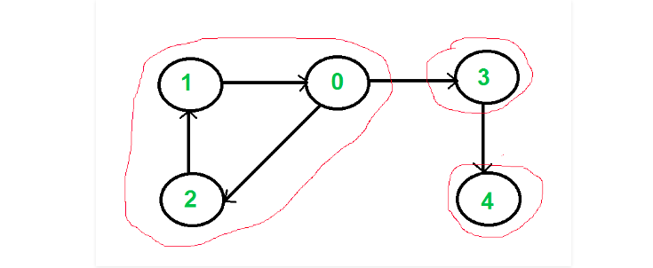

# Strongly Connected Components

A directed graph is strongly connected if there is a path between all pairs of vertices. A strongly connected component (SCC) of a directed graph is a maximal strongly connected subgraph. For example, there are 3 SCCs in the following graph.
</img>

*Basic Algo*
<pre>
1) Create an empty stack ‘S’ and do DFS traversal of a graph. In DFS traversal, after calling recursive DFS for adjacent vertices of a vertex, push the vertex to stack. In the above graph, if we start DFS from vertex 0, we get vertices in stack as 1, 2, 4, 3, 0.
2) Reverse directions of all arcs to obtain the transpose graph.
3) One by one pop a vertex from S while S is not empty. Let the popped vertex be ‘v’. Take v as source and do DFS (call DFSUtil(v)). The DFS starting from v prints strongly connected component of v. In the above example, we process vertices in order 0, 3, 4, 2, 1 (One by one popped from stack)
</pre>

Click <a href="code.cpp">here</a> to access the code.
