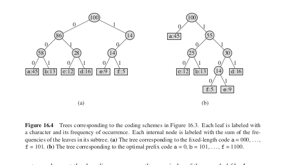

# Huffman code
> Given the frequencies f1,f2, … ,fn of n symbols, we want to minimizes the overall length of the encoding in binary.  

*<ins>Types of Encoding</ins>*

- *Naive Encoding Or Fixed Length Encoding*   
> Given n symbols use log2(n) length for each symbol, giving total space of (f1+f2+...fn)* log2(n).  

- *Variable Length Encoding*  
> *Prefix Free Property*-Encoding of a symbol can't  be a prefix of any another symbol's encoding.  
> Benefits:  
> - Decoding of a sentence can be done by moving left to right, if we encounter a symbol's encoding write that symbol and start looking for the next symbol in same way from the next bit.  
> example - A=0, B=11, C=101, D=100   the encoding 110100 stands for BAD as 11 0 100.
> - Each prefix free code can form  a binary tree with symbol as it's leaf.  
> - The cost of the tree can be calculated by adding frequency of leaf nodes and internal node,  
>   where frequency of any internal node to be the sum of the frequencies of its descendant leaves.  

**Greedy Algo**

> - *Greedy Choice Property* : The two symbols with the smallest frequencies must be at the bottom of the optimal tree, as children of the lowest internal node.  
> - *Optimum Sustructure Property* : Upon creating subtree with minimum frequency leaf node remove these nodes and add a internal node and recurse with step 1.

*Pseudo Code*
<pre>
int F[2n] ; frequency of leaf nodes and internal nodes
int H[1000];
CreatePriorityQue(H);
for (i=0 to i=n-1)
{
    insert(H,F[i]);
}
for( k=n to k=2n-2) // Internal Node
{
    i = deletemin(H);
    j = deletemin(H);
    f[k]= f[i] +f[j];
    createnode(k as head and i,j as leaf node)
    insert(H,f[k]);
}
</pre>

>> Example
</img>

>> Time Complexity = O(nlogn).