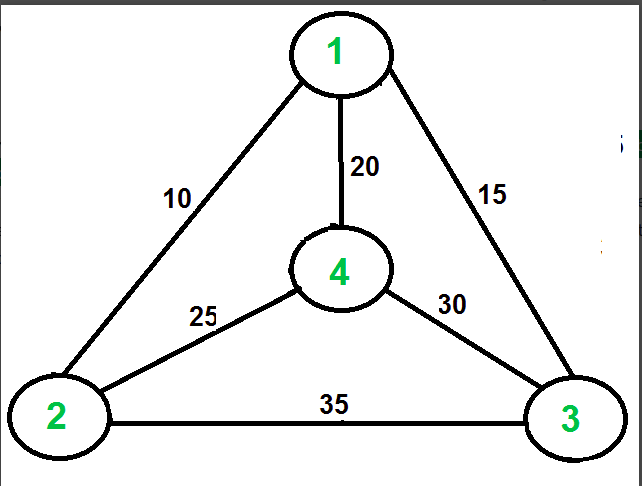
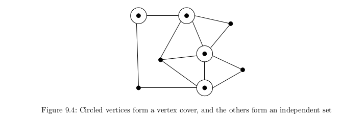

# NP Problems
*NP Class*   
A problem H is known as NP-class problem if there exist a polynomial time verifier for that problem.

*NP Hard*  
A problem H is NP-hard when for every problem L in NP, there is a polynomial-time many-one reduction from L to H.

*NP-Complete*  
A problem is known as NP-Complete if:  
- the problem belongs to NP-class
- every other NP-class problems are polynomial time reducible the given problem.

>>Examples:

***Hamiltonian Cycle***   
<ins>Problem</ins>: Hamiltonian Cycle  
<ins>Input: </ins>An unweighted graph G.  
<ins>Output:</ins> Does there exist a simple tour that visits each vertex of G without repeti-
tion?  

>>Hamiltonian cycle has some obvious similarity to the traveling salesman prob-
lem. Both problems seek a tour that visits each vertex exactly once. There are also
differences between the two problems. TSP works on weighted graphs, while Hamil-
tonian cycle works on unweighted graphs.

*Reduction Algo*
<pre>
HamiltonianCycle(G = (V, E))
Construct a complete weighted graph G' = (V' , E' ) where V' = V .
n = |V |
for i = 1 to n do
for j = 1 to n do
if (i, j) ∈ E then w(i, j) = 1 else w(i, j) = 2
Return the answer to Traveling-Salesman-Decision-Problem(G' , n).
</pre>

***Travelling Salesman Problem***   
Given a set of cities and distance between every pair of cities, the problem is to find the shortest possible route that visits every city exactly once and returns to the starting point.Example:</img>
Consider the graph shown in figure on right side. A TSP tour in the graph is 1-2-4-3-1. The cost of the tour is 10+25+30+15 which is 80.

*Proof*  
<pre> 
First, we have to prove that TSP belongs to NP. If we want to check a tour for credibility, we
check that the tour contains each vertex once. Then we sum the total cost of the edges and finally we check if the cost is minimum. This can be completed in polynomial time thus TSP belongs to
NP.  
Secondly we prove that TSP is NP-hard. One way to prove this is to show that Hamiltonian cycle
 TSP (given that the Hamiltonian cycle problem is NP-complete). Assume G = (V, E) to be an
instance of Hamiltonian cycle. An instance of TSP is then constructed. We create the complete
graph G' = (V', E'), where E′ = {(i, j):i, j ∈ V and i ≠ j. Thus, the cost function is defined as:
t(i ,j ) =  
1 if (i, j) ∉ E
0 if (i, j) ∈ E

Now suppose that a Hamiltonian cycle h exists in G. It is clear that the cost of each edge in h is 0
in G′ as each edge belongs to E. Therefore, h has a cost of 0 in G′ . Thus, if graph G has a
Hamiltonian cycle then graph G′ has a tour of 0 cost.
Conversely, we assume that G’ has a tour h’ of cost at most 0. The cost of edges in E’ are 0 and 1
by definition. So each edge must have a cost of 0 as the cost of h’ is 0. We conclude that h’
contains only edges in E.
So we have proven that G has a Hamiltonian cycle if and only if G’ has a tour of cost at most 0.
Thus TSP is NP-complete. 
</pre>

***Independent Set and Vertex Cover***

<ins>Problem</ins>: Vertex Cover  
<ins>Input:</ins> A graph G = (V, E) and integer k ≤ |V |.  
<ins>Output:</ins> Is there a subset S of at most k vertices such that every e ∈ E contains at
least one vertex in S?  
It is trivial to find a vertex cover of a graph, namely the cover that consists of
all the vertices. More tricky is to cover the edges using as small a set of vertices
as possible. For the graph in , four of the eight vertices are sufficient to
cover.  
A set of vertices S of graph G is independent if there are no edges (x, y) where
both x ∈ S and y ∈ S. This means there are no edges between any two vertices
in independent set. , independent set arises
in facility location problems. The maximum independent set decision problem is
formally defined:  
<ins>Problem</ins>: Independent Set  
<ins>Input:</ins> A graph G and integer k ≤ |V |.  
<ins>Output:</ins> Does there exist an independent set of k vertices in G?   

Both vertex cover and independent set are problems that revolve around finding special subsets of vertices: the first with representatives of every edge, the second
with no edges.   
If S is the vertex cover of G, the remaining vertices S − V must form an independent set, for if an edge had both vertices in S − V , then S could not have been a vertex cover. This gives us a reduction between the two problems:
<pre>
VertexCover(G, k)
G' = G
k' = |V | − k
Return the answer to IndependentSet(G' , k' )
</pre>

***Clique***

A  clique is a complete subgraph where each vertex pair has an edge between them. Cliques are the densest possible subgraphs:  
<ins>Problem:</ins> Maximum Clique   
<ins>Input:</ins> A graph G = (V, E) and integer k ≤ |V|.  
<ins>Output:</ins> Does the graph contain a clique of k vertices; i.e. , is there a subset S ⊂ V ,
where |S| ≤ k, such that every pair of vertices in S defines an edge of G?   

The graph in </img> contains a clique of five vertices. Within the friendship graph, we would expect to see large cliques corresponding to workplaces, neighborhoods, religious organizations, and schools.  
In the independent set problem, we looked for a subset S with no edges between two vertices of S. This contrasts with clique, where we insist that there always be an edge between two vertices.  
A reduction between these problems follows by reversing
the roles of edges and nonedges—an operation known as complementing the graph:
<pre>
IndependentSet(G, k)
Construct a graph G' = (V' , E' ) where V' = V , and
For all (i, j) not in E, add (i, j) to E'
Return the answer to Clique(G' , k)
</pre>