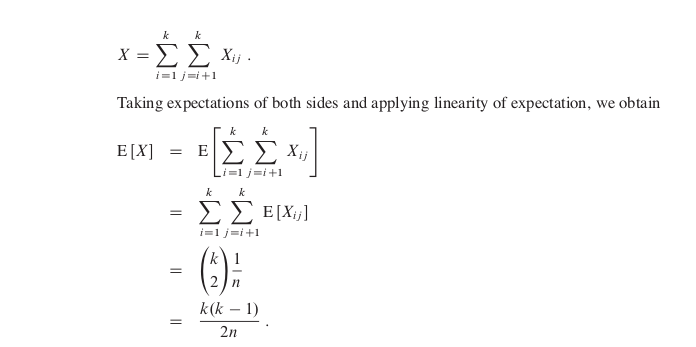

# The Birthday Paradox
>>How many people must there be in a room before there is a 50% chance that two of them were born on the same day of
the year? The answer is surprisingly few. The paradox is that it is in fact far fewer than the number of days in a year, or even half the number of days in a year, as we shall see.   

> We index the people in the room with the integers
1, 2, .  .  .  , k, where k is the number of people in the room. We ignore the issue
of leap years and assume that all years have n  = 365 days. For i  = 1, 2, .  .  .  , k,
let b i be the day of the year on which person i’s birthday falls, where 1 <= bi <= n.
We also assume that birthdays are uniformly distributed across the n days of the
year, so that Pr[b i  = r]= 1/n for i  = 1, 2, .  .  .  , k and r  = 1, 2, .  .  .  , n.

We assume from now on that birthdays are independent, so that the probability that i’s birthday and j ’s birthday both fall on day r is:
<pre>
Pr[bi = r and bj = r] = Pr[bi = r]*Pr[bj = r]
= 1/n^2 :
Thus, the probability that they both fall on the same day is
Pr[bi = bj] = Σ (P{bi=r and bj=r})
=Σ(1/n^2)
=1/n
</pre>
The event that k people have distinct birthdays is
<pre>Bk = ∩Ai</pre> where Ai is the event that person i’s birthday is different from person j ’s for all j < i.  
Since we can write Bk = Ak ∩ Bk-1 , we obtain from equation of recurrence  
<pre>
Pr{Bk} = Pr{B k-1} Pr{Ak|B k-1 } ;
</pre>
where we take Pr{B1} = Pr{A1} = 1 as an initial condition.  
In other words,
the probability that b 1 , b 2 , . . . , b k are distinct birthdays is the probability that
b1 , b2 , . . . , bk-1 are distinct birthdays times the probability that bk != bi for
i = 1, 2, . . . , k-1, given that b1 , b2 , . . , bk-1 are distinct.   
On Solving ...
<pre>P{Bk}<=1/2</pre>

when **-k.(k - 1)/2n <= ln(1/2)**. The probability that all k birthdays are distinct
is at most 1/2
p when k.(k - 1) >= 2nln(1/2) or, solving the quadratic equation, when
k >=  [ 1+√(1+8 ln2*n) ]/2. For n = 365, we must have k >= 23. Thus, if at
least 23 people are in a room, the probability is at least 1/2 that at least two people have the same birthday.

>> ***Using Indicator Random Variables***
We can use indicator random variables to provide a simpler but approximate anal-
ysis of the birthday paradox. For each pair (i, j) of the k people in the room, we define the indicator random variable X ij , for 1 <=i < j <= k, by
</img>
When (k.(k - 1)) <=2n, therefore, the expected number
p of pairs of people with the same birthday is at least 1. Thus, if we have at least (1+√2n) individuals in a room,
we can expect at least two to have the same birthday.

>The analysis, determined the number of people required for the probability to exceed 1/2 that a matching pair of birthdays exists

>>Although the exact numbers of people differ for the two situations:  
- one which uses only, probabilities
- one which uses indicator random variable  
>>they are the same asympptotically: O(√n)