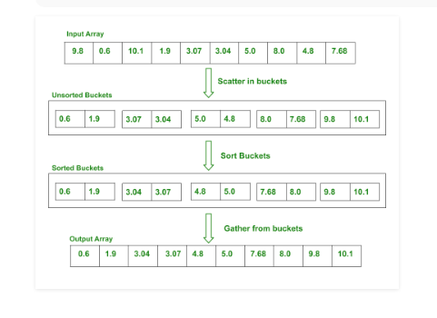

# Bucket Sort
>>Basic Algo
<pre>
bucketSort(arr[], n)
1) Create n empty buckets (Or lists).
2) Do following for every array element arr[i].
.......a) Insert arr[i] into bucket[n*array[i]]
3) Sort individual buckets using insertion sort.
4) Concatenate all sorted buckets.
</pre>
More elaborately:
<pre>
1. Find maximum element and minimum of the array
2. Calculate the range of each bucket
      range = (max - min) / n
      n is the number of buckets
3. Create n buckets of calculated range

4. Scatter the array elements to these buckets
      BucketIndex = ( arr[i] - min ) / range

5. Now sort each bucket individually

6. Gather the sorted elements from buckets to original array
</pre>
>>Examples:
Example1</img>
Example2</img>

>*Note:*  
Bucket sort assumes that the input is drawn from a uniform distribution and has an average-case running time of O[n].  
Like counting sort, bucket sort is fast because it assumes something about the input.  
Whereas counting sort assumes that the input  consists of integers in a small range, bucket sort assumes that the input is generated by a random process that distributes elements uniformly and independently over the interval [0, 1].

Click <a href="code.c">here</a> to access the code.
