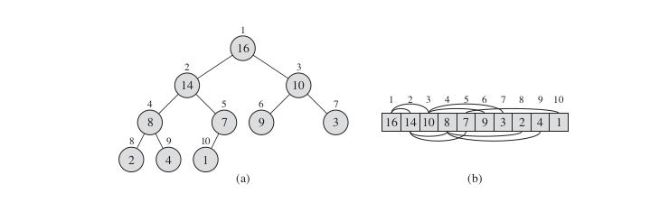

# Heap Sort
Heap Sort is an sorting algorithm that involves use of Heap.  
>The Heap can be viewed as </img>
The array view of the heaps led to invention of heap sort.

>> *Basic Algo*
- The heapsort algorithm starts by using BUILD-MAX-HEAP to build a max-heap on the input array A[1...n], where n = A:length. - Since the maximum elementof the array is stored at the root A[1], we can put it into its correct final position by exchanging it with A[n]. 
- If we now discard node n from the heap—and we
can do so by simply decrementing A.heap-size—we observe that the children of
the root remain max-heaps, but the new root element might violate the max-heap
property. All we need to do to restore the max-heap property, however, is call
MAX-HEAPIFY(A, 1), which leaves a max-heap in A[1..n-1]. 
- The heapsort
algorithm then repeats this process for the max-heap of size n - 1 down to a heap
of size 2.

>> Time Complexity: O(nlogn)

Click <a href="code.cpp">here</a> to access the code. 