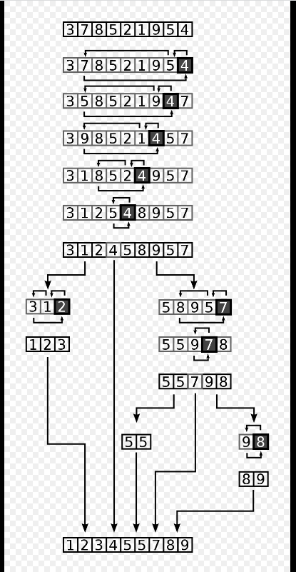

# Quick Sort
Quicksort is a type of divide and conquer algorithm for sorting an array.
>>*Basic Algo*  
<pre>
/* low  --> Starting index,  high  --> Ending index */
quickSort(arr[], low, high)
{
    if (low < high)
    {
        /* pi is partitioning index, arr[pi] is now
           at right place */
        pi = partition(arr, low, high);

        quickSort(arr, low, pi - 1);  // Before pi
        quickSort(arr, pi + 1, high); // After pi
    }
}
</pre>
>>The partition function takes the chosed element put it in it's right place in the sorted array.

*Example*  
</img>

>>Time Complexity: O(n^2)

Click <a href="code.c">here</a> to access the code.
