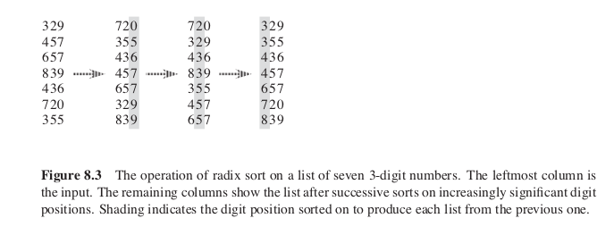

# Radix Sort

>>*Basic Algo*
- Do following for each digit i where i varies from least significant digit to the most significant digit.
- Sort input array using counting sort (or any stable sort) according to the i’th digit.

>Example  
</img>

>> Time Complexity:   
Given n d -digit numbers in which each digit can take on up to k possible values, RADIX-SORT correctly sorts these numbers in O(d.(n + k)// time

Click <a href="code.c">here</a> to access the code.
